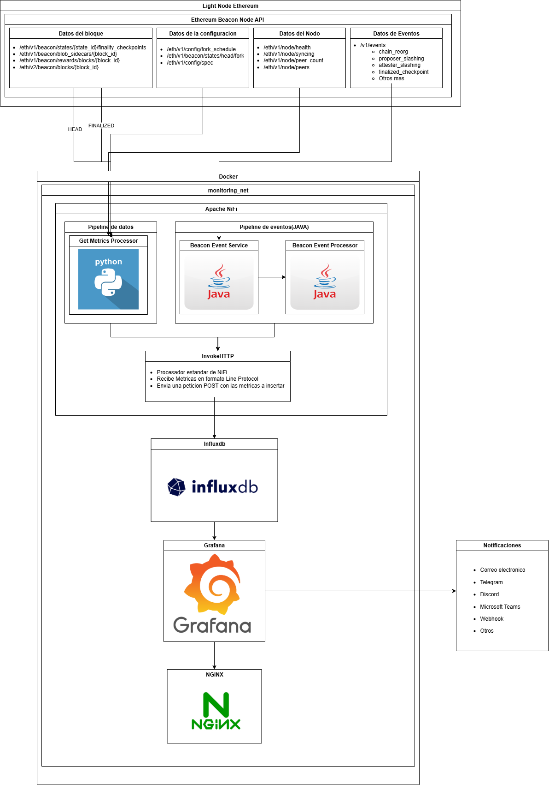

# tfg-ethereum-monitor

Monitoring system for the Ethereum network using Docker, Grafana, InfluxDB, NiFi, and an Nginx server.



## Requirements

Before starting, make sure you have the following components installed:

- [Docker](https://docs.docker.com/get-docker/)

## How to start the environment

### 1. Clone the repository

```bash
git clone https://github.com/fxsosa/tfg-monitor-ethereum.git
cd tfg-monitor-ethereum
```

### 2. Start the services with Docker Compose
`docker compose up`

This command will start all the containers defined in the docker-compose.yml file.

### Stack used
- NiFi: for ETL flow definition
- InfluxDB: for metrics storage
- Grafana: for metrics visualization
### Documentation
For detailed information about this project, please refer to:

- Complete documentation [libro.pdf](./docs/libro.pdf): Full technical documentation covering the system architecture, implementation details, and usage guide.
- Presentation slides [diapositiva_defensa.pdf](./docs/diapositiva_defensa.pdf): Summary presentation of the project's key features and results.